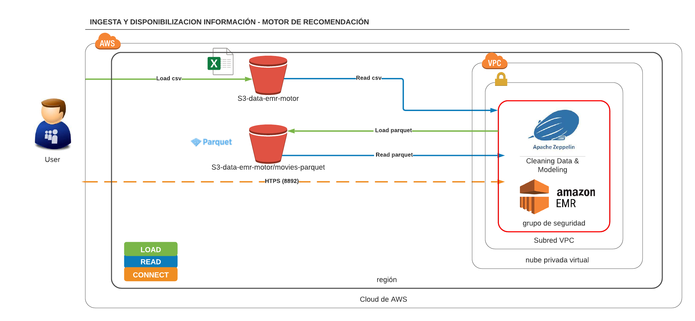
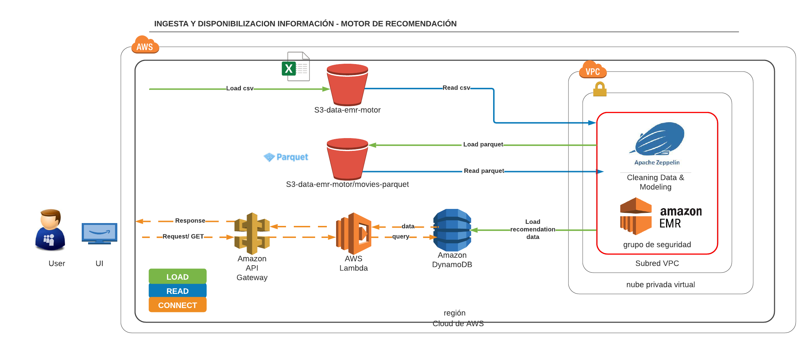

# sistema-recomendacion-aws-zepellin

## Contenido:
- data: directorio para alojamiento de origenes de datos  
- imagen: directorio para alojamiento de imagenes sobre la arquitectura
- main: directorio para alojamiento de código fuente  
## Infraestructura necesaria:
El clúster EMR para este proyecto se configura de tal manera que sea escalable de 2 (Iniciales) a 10 (Máximo) nodos esclavos a demanda dependiendo del health de los nodos, además se realiza la instalación de los siguientes aplicativos sobre la versión EMR: 5.33.0  
    • Spark: Spark 2.4.7    
    • Hadoop 2.10.1   
    • YARN   
    • Zeppelin 0.9.0  
En el grupo de seguridad de la instancia maestra, se modifican el grupo de seguridad para todo el tráfico entrante por el puerto (8890) con el fin de acceder a Zeppelin por la web.    

## Instrucciones ejecución:

- Carga de datos a carpeta **data
- Ejecución de script **main/upload_to_s3.py** para cargar datos de manera local a bucket s3
- Inicializar **cluster EMR  
- Ejecución de notebook **main/movies_csv_to_parquet.ipynb**  en **Apache Zeppelin** para convertir csv a parquet usando spark
- Ejecución ......
    
      
## Arquitectura Sistema de recomendación:

## Arquitectura producción:

