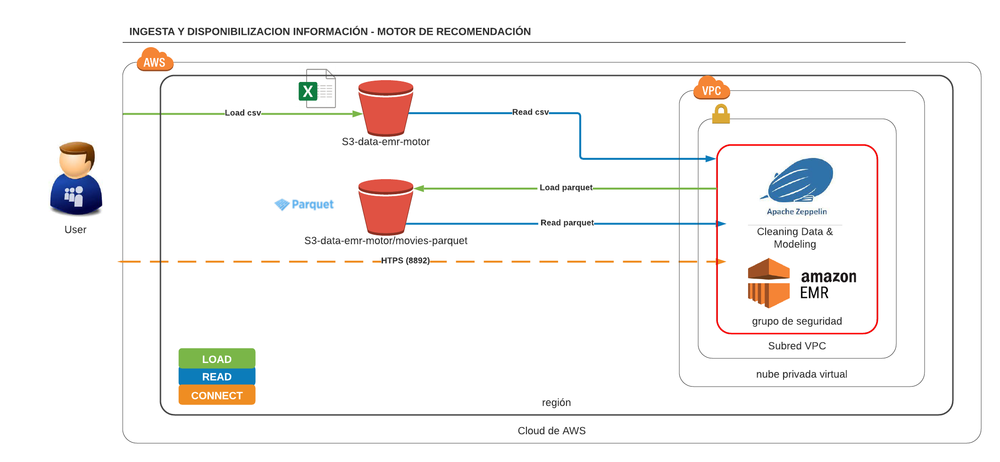
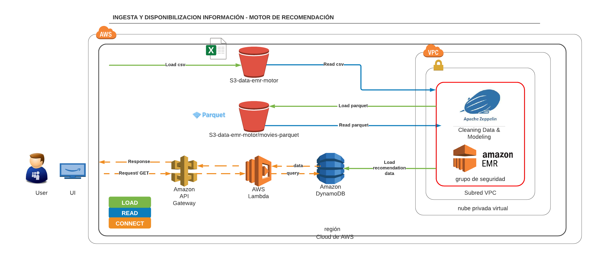

# sistema-recomendacion-aws-zepellin

## Contenido:
- data: directorio para alojamiento de origenes de datos  
- main: directorio para alojamiento de código fuente  

## Instrucciones ejecución:
  
    
      
## Arquitectura Sistema de recomendación:

## Arquitectura producción:

